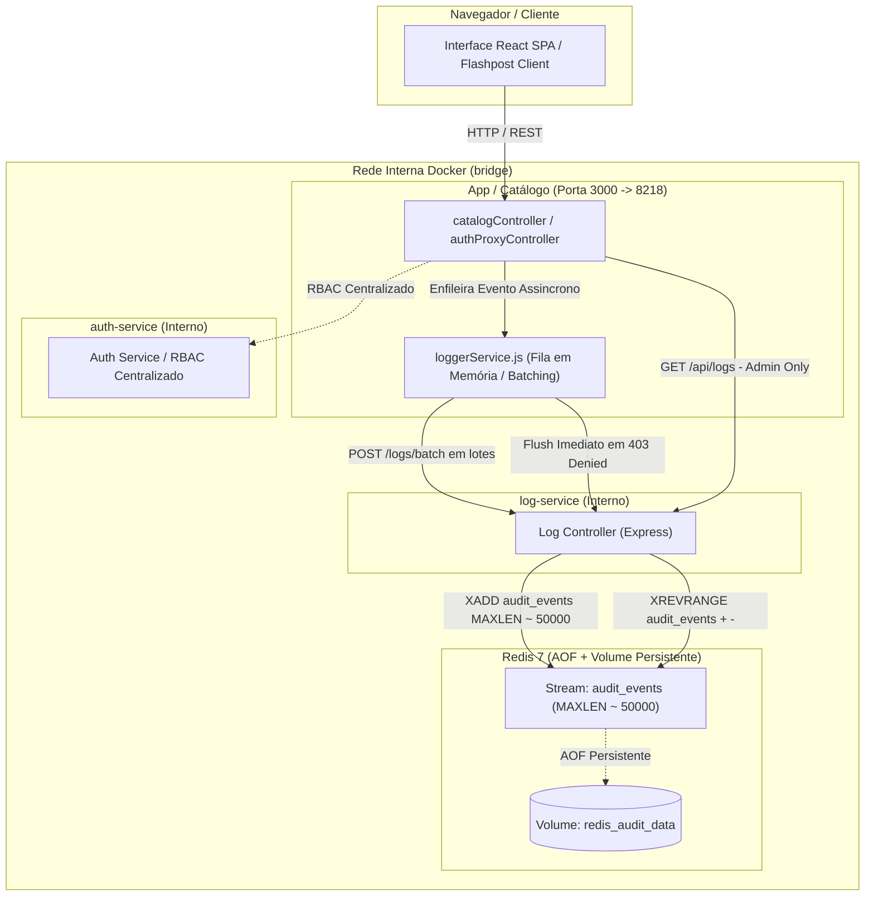
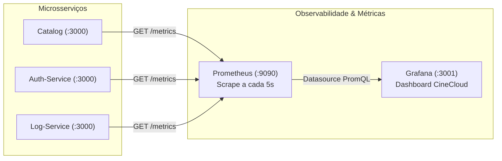

# Atividade de Cloud — Professor: [github.com/siriani](https://github.com/siriani)

Este repositório contém a implementação da atividade de Cloud, com Frontend em React (Vite) e Backend em Node.js (Express) com MariaDB, integrados à API da TMDB.

## Funcionalidades
- Cadastro e Login com hash de senhas e geração de JWT.
- **NOVO:** Microsserviço de autenticação isolado na rede interna do Docker (Atividade 3).
- **NOVO:** Recuperação de senha por e-mail com token e expiração (via Mailtrap).
- Isolamento de dados por usuário.
- Listagem de filmes do ator Tom Hanks usando a API oficial da TMDB (pesquisada via Backend).
- Favoritar filmes (armazenados no MariaDB pessoal).
- Comentar filmes (armazenados no MariaDB pessoal).
- **NOVO (Atividade 4):** Controle de Acesso Baseado em Papéis (RBAC) com enforcement no backend e moderação de comentários.
- **NOVO (Atividade 5):** Observabilidade & Logs de Auditoria — Microsserviço próprio (`log-service`) com Redis Streams, padrão CloudEvents v1.0, ECS e NIST SP 800-92.
- **NOVO (Atividade Extra):** Documentação interativa das APIs com Swagger UI e especificação OpenAPI 3.0 para os 3 microsserviços (Catálogo, Auth e Logs).
- **NOVO (Atividade Extra):** Observabilidade & Métricas com Prometheus e Healthchecks (Liveness & Readiness) com detecção de falha no Docker Compose.
- **NOVO (Atividade Extra):** Pipeline de CI/CD com GitHub Actions, Testes Automatizados, Publicação no GHCR (com tags de commit) e Deploy Contínuo com Watchtower/Portainer.


## Atividade 4 · Controle de Acesso por Papel (RBAC de Verdade)

### 1. Permissões Documentadas por Papel

No sistema, o controle de acesso é baseado no papel (`role`) atribuído ao usuário autenticado (`user`/`usuario` ou `admin`). O servidor valida estritamente cada ação.

| Recurso | Ação | Papel `usuario` | Papel `admin` | Endpoint |
|---|---|:---:|:---:|---|
| **Filmes** | Listar catálogo (Tom Hanks) | ✅ Permitido | ✅ Permitido | `GET /api/movies` |
| **Favoritos** | Listar próprios favoritos | ✅ Permitido | ✅ Permitido | `GET /api/favorites` |
| **Favoritos** | Adicionar favorito | ✅ Permitido | ✅ Permitido | `POST /api/favorites` |
| **Favoritos** | Remover próprio favorito | ✅ Permitido | ✅ Permitido | `DELETE /api/favorites/:id` |
| **Comentários** | Visualizar comentários nos filmes | ✅ Permitido | ✅ Permitido | `GET /api/comments/:id` |
| **Comentários** | Criar novo comentário | ✅ Permitido | ✅ Permitido | `POST /api/comments` |
| **Comentários** | Apagar o **próprio** comentário | ✅ Permitido | ✅ Permitido | `DELETE /api/comments/:id` |
| **Comentários** | Apagar comentário de **outros** (Moderação) | ❌ **403 Forbidden** | ✅ **200 OK** | `DELETE /api/comments/:id` |
| **Usuários** | Listar todos os usuários do sistema | ❌ **403 Forbidden** | ✅ **200 OK** | `GET /api/users` |

- **O que `usuario` pode fazer:** Pode navegar pelo catálogo de filmes, gerenciar sua própria lista de favoritos, publicar comentários em filmes e remover os seus próprios comentários.
- **O que `admin` pode fazer além disso:** Possui poder de **moderação total** sobre comentários (pode apagar comentários feitos por qualquer outro usuário) e acesso administrativo para visualizar todos os usuários cadastrados e seus respectivos papéis.

---

### 2. Ação Exclusiva de Admin e Enforcement no Backend

A ação exclusiva implementada é a **Moderação de Comentários** (`DELETE /api/comments/:id`):
- Quando um autor tenta apagar seu próprio comentário (`comment.usuario_id === req.userId`), a ação é autorizada imediatamente (**200 OK**).
- Quando qualquer usuário tenta apagar um comentário que pertence a outro usuário, o backend intercepta a ação e realiza a verificação de permissão no servidor via rede interna com o `auth-service`.
  - Se o usuário solicitante **não for admin**, o servidor recusa a requisição e responde com **403 Forbidden**: `{"error": "Acesso negado: apenas administradores podem apagar comentários de outros usuários."}`.
  - Se o usuário solicitante **for admin**, o servidor executa a exclusão com sucesso e responde com **200 OK**: `{"message": "Comentário excluído com sucesso (Ação de Moderação/Admin)"}`.
- Mesmo que o usuário comum tente invocar o endpoint diretamente via Postman, cURL ou manipular a interface, o backend bloqueia a ação, garantindo segurança real no servidor.

---

### 3. Demonstração Prática (Requisito 4)

A validação prática do controle de acesso baseado em papéis (RBAC) com enforcement no backend foi realizada com dois logins distintos tentando a mesma ação exclusiva de moderação (`DELETE /api/comments/:id`):

#### 📸 Print 1: Usuário Comum tenta apagar comentário de outro autor (403 Forbidden)
O usuário com papel `usuario` autenticado tenta apagar diretamente o comentário pertencente a outro autor (`DELETE /api/comments/100`). O backend intercepta a ação, consulta o `auth-service` via rede interna e **recusa imediatamente com HTTP 403 Forbidden**, comprovando que a segurança é aplicada no servidor:


---

#### 📸 Print 2: Administrador modera comentário de outro usuário (200 OK)
O usuário com papel `admin` autenticado executa a moderação em comentário criado por outro usuário (`DELETE /api/comments/200`). O backend consulta o `auth-service`, confirma o privilégio de administrador e **executa a exclusão com HTTP 200 OK**:


---

### 4. Segurança de Credenciais e Roles: Tratamento Exclusivo no Backend

Seguindo as melhores práticas de segurança corporativa e desenvolvimento web:
- **Zero Credenciais no Frontend (Cookies HttpOnly):** O token JWT não é exposto ao JavaScript do cliente e não é gravado em `localStorage`. No login, o backend define um cookie `HttpOnly; SameSite=Lax; Path=/`, garantindo imunidade a ataques de injeção XSS que tentem ler ou roubar a credencial. Todas as requisições subsequentes utilizam o cookie automaticamente com `withCredentials: true`. A validação e encerramento de sessão ocorrem através dos endpoints `/api/me` e `/api/logout`.
- **Zero Lógica de Roles no Frontend:** O cliente não realiza checagens condicionais de papel (`role === 'admin'`). O backend é a autoridade única e decide quais ações o usuário pode realizar, entregando capacidades funcionais já resolvidas (como `can_delete` e `is_moderation` nos comentários, e `can_manage_users` no perfil). Toda requisição para endpoints protegidos continua estritamente validada no servidor.

---

### 5. Resposta Técnica: Padrão A ou Padrão B? (Requisito 5)

> **Pergunta:** Qual dos dois padrões da seção de arquitetura o seu auth-service usa hoje? E o que mudaria no seu código se fosse pro outro padrão?

#### Qual padrão utilizamos hoje?
Nosso sistema utiliza o **PADRÃO A — Enforcement Centralizado**.

O serviço de catálogo (`backend`) atua desacoplado das regras de autorização dos usuários. Quando uma ação restrita ou sensível é solicitada (como moderação de comentários ou listagem administrativa de usuários), o catálogo realiza uma chamada HTTP interna via rede para o endpoint `POST /authorize` do `auth-service`, enviando o `userId` e a regra exigida (`requiredRole: 'admin'`). O `auth-service` consulta o papel atualizado do usuário diretamente no banco de dados MariaDB e decide centralizadamente se a ação é permitida ou não.

#### O que mudaria no código se fôssemos para o Padrão B (claims no JWT)?
Se migrássemos para o **Padrão B (Claims no JWT)**:
1. **No catálogo (`backend`):** Eliminaríamos a chamada de rede interna (`axios.post('${AUTH_SERVICE_URL}/authorize')`). O middleware de autenticação (`authenticateToken`) decodificaria o token JWT assinado e leria diretamente a propriedade `req.user.role`. A verificação seria puramente local em memória: `if (req.user.role !== 'admin') return res.status(403)`.
2. **No `auth-service`:** O endpoint `/authorize` deixaria de ser necessário para checagens em tempo de execução, já que a claim `role` viajaria encapsulada e assinada no próprio token.
3. **Trade-offs técnicos:**
   - **Vantagem do Padrão B:** Menor latência (elimina o round-trip de rede para cada ação restrita) e menor sobrecarga no `auth-service`.
   - **Desvantagem do Padrão B:** Perda de revogação/atualização imediata. Se um usuário for rebaixado ou promovido no banco, seu papel só terá efeito quando o token JWT atual expirar e um novo for gerado. No Padrão A adotado, qualquer alteração no banco tem efeito instantâneo.

---

## Atividade 5 · Observabilidade: Logs e Auditoria com Redis Streams

### 1. Arquitetura e Microsserviço Dedicado (`log-service`)

O sistema foi evoluído para garantir rastreabilidade completa e imutabilidade das ações executadas pelos usuários (quem fez o quê, quando e de onde). Em vez de gravar logs em arquivos locais de cada container — o que causaria dispersão, concorrência em I/O de disco e risco de exclusão acidental —, toda a ingestão e consulta de auditoria foi centralizada em um microsserviço dedicado: o **`log-service`**, integrado com **Redis Streams**.



#### Decisões Arquiteturais e Isolamento
- **Microsserviço Próprio (`log-service`):** Opera internamente na rede Docker sem portas expostas ao host (`ports` omitido no Docker Compose), prevenindo acesso externo não autorizado aos dados brutos de auditoria.
- **Por que Redis Streams?**
  - **Ordenação Temporal Estrita:** Cada evento na Stream recebe um ID cronológico gerado pelo Redis (`<millisecondsTime>-<sequenceNumber>`), garantindo sequência imutável de fatos.
  - **Eficiência Extrema de Ingestão:** O comando `XADD` possui complexidade \(O(1)\) para inserção.
  - **Controle de Volumetria Amortizado (`MAXLEN ~ 50000`):** O operador de aproximação `~` executa o corte de nós de macro-páginas (radix tree) do Redis de forma amortizada, eliminando pausas de thread do Redis causadas por trimming estrito.
  - **Consultas Paginadas Decrescentes (`XREVRANGE`):** Permite leitura ultra rápida a partir dos eventos mais recentes até os mais antigos com paginação via cursor.
- **Garantias de Persistência no Redis:**
  - Configurado com **AOF (Append-Only File)** ativo: `redis-server --appendonly yes --maxmemory 256mb --maxmemory-policy noeviction`.
  - Política `noeviction` garante que eventos de auditoria e segurança **nunca sejam descartados silenciosamente por falta de memória**.
  - Os dados são persistidos no volume Docker nomeado **`redis_audit_data`**, preservando o histórico de eventos mesmo após reinicializações completas dos containers.

---

### 2. Resiliência do Cliente Assíncrono (`backend/src/services/loggerService.js`)

Para proteger os serviços produtores (`backend`/catálogo e `auth`) contra gargalos e vazamento de conexões, a integração não realiza disparos HTTP bloqueantes nem "fire-and-forget" ingênuo. O cliente foi estruturado com os seguintes pilares de confiabilidade:

1. **Fila em Memória e Envio em Lote (Batching):** Os eventos são enfileirados em um buffer interno não-bloqueante e despachados em lotes para `POST /logs/batch` a cada **500 ms** ou assim que a fila atinge **10 eventos**.
2. **Despacho Imediato para Segurança (Immediate Flush):** Eventos com status `denied` ou ação de segurança (`tentativa_negada_403`) recebem prioridade máxima, acionando o esvaziamento imediato (`setImmediate`) para que violações de segurança fiquem disponíveis instantaneamente para inspeção.
3. **Retentativas Automáticas com Backoff Exponencial:** Caso o `log-service` esteja temporariamente indisponível durante uma reinicialização, o cliente reexecuta o envio do lote até 3 vezes com esperas exponenciais (200ms, 400ms, 800ms) antes de descartar.
4. **Sanitização de Dados Sensíveis (LGPD / GDPR / NIST):** O método `sanitize()` remove ou redige automaticamente chaves sensíveis como senhas, hashes, secrets e tokens JWT (`[REDACTED]`), impedindo que credenciais vazem para a base de auditoria.
5. **Rastreabilidade Distribuída (Correlation ID):** O middleware `correlationMiddleware.js` gera ou propaga um identificador único de rastreamento (`x-correlation-id`) via `crypto.randomUUID()`, anexado ao evento como `trace_id`.

---

### 3. Padrão Estrutural do Evento de Auditoria (CloudEvents v1.0 + ECS + NIST SP 800-92)

Todos os eventos gravados na Stream seguem o padrão global aberto **CloudEvents v1.0**, complementado com a taxonomia do **Elastic Common Schema (ECS)** e as diretrizes do **NIST SP 800-92** (Computer Security Log Management):

```json
{
  "stream_id": "1789749826217-0",
  "specversion": "1.0",
  "id": "1789749826215-98f7f626",
  "source": "service.catalog",
  "type": "audit.security.access_denied",
  "time": "2026-09-18T16:43:46.215Z",
  "trace_id": "6c5b6a68-0bfa-4d5e-b495-e7a0b152f0b0",
  "actor": {
    "id": "8",
    "role": "user",
    "ip": "127.0.0.1",
    "user_agent": "axios/1.20.0"
  },
  "action": "tentativa_negada_403",
  "status": "denied",
  "target": {
    "type": "comment",
    "id": 202,
    "author_id": 7
  },
  "metadata": {
    "motivo": "Tentativa não autorizada de apagar comentário de outro usuário"
  }
}
```

#### Dicionário de Campos Obrigatórios:
- **`specversion`**: Versão da especificação CloudEvents (`"1.0"`).
- **`id`**: Identificador único global do evento de log.
- **`source`**: Microsserviço originador do evento (`"service.catalog"`, `"service.auth"`).
- **`type`**: Categoria taxonômica do evento (ex: `audit.auth.login`, `audit.security.access_denied`).
- **`time`**: Carimbo de data/hora em formato UTC ISO-8601 estrito.
- **`trace_id`**: Identificador único de correlação de ponta a ponta da requisição.
- **`actor`**: Identidade completa do autor (`id`, `role`, `ip`, `user_agent`).
- **`action`**: Nome semântico e objetivo da ação executada.
- **`status`**: Resultado da operação (`"success"` ou `"denied"`).
- **`target`**: Objeto de negócio impactado (`movie`, `comment`, `session`, `route`).
- **`metadata`**: Contexto adicional sanitizado da operação.

---

### 4. Tabela de Eventos de Auditoria Monitorados

| Evento de Auditoria | Origem | Ação Semântica (`action`) | Tipo CloudEvents | Status | Alvo (`target`) |
|---|---|---|---|:---:|---|
| **Login bem-sucedido** | `service.auth` | `login` | `audit.auth.login` | `success` | `{ "type": "session" }` |
| **Login falho** | `service.auth` | `login_falhou` | `audit.auth.login_failed` | `denied` | `{ "type": "session" }` |
| **Logout** | `service.auth` | `logout` | `audit.auth.logout` | `success` | `{ "type": "session" }` |
| **Favoritar filme** | `service.catalog` | `favoritar` | `audit.favorite.add` | `success` | `{ "type": "movie", "id": 862 }` |
| **Desfavoritar filme** | `service.catalog` | `desfavoritar` | `audit.favorite.remove` | `success` | `{ "type": "movie", "id": 862 }` |
| **Adicionar comentário** | `service.catalog` | `comentar` | `audit.comment.create` | `success` | `{ "type": "comment", "id": <id> }` |
| **Apagar próprio comentário** | `service.catalog` | `apagar_comentario_proprio` | `audit.comment.delete_own` | `success` | `{ "type": "comment", "id": <id> }` |
| **Moderar comentário alheio** | `service.catalog` | `moderar_comentario` | `audit.comment.moderate` | `success` | `{ "type": "comment", "id": <id>, "author_id": <id> }` |
| **Tentativa Negada (Moderação)** | `service.catalog` | `tentativa_negada_403` | `audit.security.access_denied` | `denied` | `{ "type": "comment", "id": <id>, "author_id": <id> }` |
| **Tentativa Negada (Logs/Admin)**| `service.catalog` | `tentativa_negada_403` | `audit.security.access_denied` | `denied` | `{ "type": "route", "method": "GET", "path": "/api/logs" }` |

---

### 5. Endpoint de Consulta de Auditoria (`GET /api/logs`)

O acesso à trilha de auditoria é rigorosamente protegido por RBAC com validação centralizada:
- **Requisição por Usuário Comum:** Interceptada pelo middleware `requireAdminCentralized`. O servidor rejeita a chamada com **HTTP 403 Forbidden**, e **automaticamente registra um evento de tentativa negada (`tentativa_negada_403`) com prioridade imediata na Stream**.
- **Requisição por Administrador:** O backend autoriza a solicitação e consulta o `log-service` via rede interna, consumindo os eventos através do comando Redis `XREVRANGE audit_events + - COUNT <limit>` com paginação por cursor decrescente.
- **Painel Visual Integrado no Frontend:** O administrador possui o botão **`📜 Logs (Redis)`** no cabeçalho do catálogo, abrindo uma tabela interativa que exibe a trilha de auditoria em tempo real, com destaque para ações negadas (críticas) e identificadores de Stream.

---

### 6. Validação Prática e Sequência de Demonstração (Requisito da Atividade)

A validação de ponta a ponta do pipeline de observabilidade foi executada através da sequência completa de ações reais:

1. **Login de Usuário Comum (`usuario@teste.com`):** Sessão aberta e registrada como `audit.auth.login`.
2. **Favoritar Filme 862 (Toy Story):** Gravado evento `audit.favorite.add`.
3. **Publicar Comentário no Filme 862:** Gravado evento `audit.comment.create` (ID #201).
4. **Tentativa Negada de Apagar Comentário Alheio:** Usuário comum tenta deletar comentário criado pelo Admin. O backend recusa com **403 Forbidden** e dispara imediatamente o evento `audit.security.access_denied` (`tentativa_negada_403`).
5. **Tentativa Negada de Consultar Logs:** Usuário comum tenta acessar `GET /api/logs`. Recusado com **403 Forbidden** e registrado na auditoria.
6. **Login de Administrador (`admin_rbac@teste.com`):** Sessão administrativa registrada.
7. **Consulta de Logs pelo Administrador:** A chamada `GET /api/logs?limit=10` retorna com **200 OK** a trilha íntegra persistida na Stream do Redis.
8. **Moderação de Comentário por Administrador:** O admin exclui o comentário do usuário comum, registrando o evento de moderação `audit.comment.moderate`.

#### Evidência de Execução Real no Terminal / Redis:
```text
=== INICIANDO TESTE END-TO-END DE AUDITORIA & REDIS STREAMS ===

[1] Login como Usuario Comum (usuario@teste.com)...
Usuario Comum logado com sucesso! Cookie recebido.

[2] Usuario Comum favoritando filme 862 (Toy Story)...
Favorito adicionado: { message: 'Adicionado aos favoritos' }

[3] Usuario Comum comentando no filme 862...
Comentário criado com ID: 201

[4] Tentativa Negada 403: Usuario Comum tentando apagar comentário que não é dele...
Tentativa de apagar comentário de outro usuário retornou STATUS: 403 {
  error: 'Acesso negado: apenas administradores podem apagar comentários de outros usuários.'
}

[5] Tentativa Negada 403: Usuario Comum tentando consultar /api/logs...
Status retornado: 403 Mensagem: { error: 'Acesso negado: privilégios de administrador necessários.' }

[6] Login como Admin (admin_rbac@teste.com)...
Admin logado com sucesso!

[7] Admin consultando /api/logs (Redis Streams)...
Logs retornados com sucesso!
Total de logs recebidos: 9
Log #1: action=login status=success actor={"id":"7","role":"admin"} target={"type":"session"}
Log #2: action=tentativa_negada_403 status=denied actor={"id":"8","role":"user"} target={"type":"route","method":"GET","path":"/api/logs"}
Log #3: action=tentativa_negada_403 status=denied actor={"id":"8","role":"user"} target={"type":"comment","id":202,"author_id":7}
Log #4: action=comentar status=success actor={"id":"8","role":"user"} target={"type":"comment","id":201,"tmdb_movie_id":862}
Log #5: action=favoritar status=success actor={"id":"8","role":"user"} target={"type":"movie","id":862}

[8] Admin moderando comentário 201 criado por Usuario Comum...
Resultado moderação admin: {
  message: 'Comentário excluído com sucesso (Ação de Moderação/Admin)'
}
```

---

### 7. Como Testar via Flashpost / Postman

Importe a collection disponível na raiz do repositório:
- **Collection:** [`cloud-atividade.flashpost_collection.json`](./cloud-atividade.flashpost_collection.json)
- **Environment:** [`cloud-atividade.flashpost_environment.json`](./cloud-atividade.flashpost_environment.json)

Execute as requisições na pasta **`⭐ 4. Observabilidade & Auditoria Redis (Atividade 5)`**:
1. **`4.1 [ATV 5] Usuário Comum tenta consultar /api/logs`**: Confirma o retorno **`403 Forbidden`**.
2. **`4.2 [ATV 5] Admin consulta Trilha de Auditoria /api/logs`**: Retorna **`200 OK`** com todos os eventos estruturados consumidos da Stream do Redis.
3. **`4.3 [ATV 5] Admin consulta Logs com Paginação Cursor`**: Demonstra a navegação paginada decrescente utilizando o `cursor` do Redis Streams.

---

## Atividade Extra · Documentando suas APIs com Swagger / OpenAPI

### 1. Visão Geral da Especificação e Arquitetura

Para tornar todos os contratos de API visíveis, padronizados e testáveis diretamente pelo navegador (sem necessidade de consultar o código-fonte), a plataforma CineCloud foi 100% documentada sob a especificação **OpenAPI 3.0.3**, integrando a interface interativa do **Swagger UI**:

- **Interface Interativa do Swagger UI:** Disponível embutida no gateway da aplicação em [`http://localhost:8218/api-docs`](http://localhost:8218/api-docs) (alias: [`http://localhost:8218/apidocs`](http://localhost:8218/apidocs)).
- **Especificação OpenAPI Pura:**
  - Formato JSON: [`docs/openapi.json`](./docs/openapi.json) (ou endpoint `GET /api/openapi.json`).
  - Formato YAML: [`docs/openapi.yaml`](./docs/openapi.yaml) pronto para importar no [editor.swagger.io](https://editor.swagger.io).
- **Atalho no Frontend:** Botão **"Swagger"** adicionado no cabeçalho executivo da aplicação CineCloud, permitindo alternar instantaneamente entre a interface visual e a documentação técnica.

---

### 2. Microsserviços e Endpoints Documentados (14 Contratos)

A especificação engloba os 3 microsserviços do ecossistema CineCloud (atendendo amplamente ao Requisito 1 de cobrir múltiplos serviços):

| Microsserviço | Tag | Método | Endpoint | Descrição & Respostas Mapeadas |
| :--- | :--- | :---: | :--- | :--- |
| **Auth-Service** | Autenticação & Sessão | `POST` | `/api/register` | Registro de novos usuários com hash bcrypt (201, 400, 409). |
| **Auth-Service** | Autenticação & Sessão | `POST` | `/api/login` | Autenticação, emissão de JWT e auditoria (200, 400, 401). |
| **Auth-Service** | Autenticação & Sessão | `POST` | `/api/logout` | Encerramento de sessão e registro de auditoria (200). |
| **Auth-Service** | Autenticação & Sessão | `GET` | `/api/me` | Consulta do usuário logado via Bearer JWT (200, 401). |
| **Auth-Service** | Autenticação & Sessão | `POST` | `/api/forgot-password`| Disparo de token de recuperação via Mailtrap (200, 400). |
| **Auth-Service** | Autenticação & Sessão | `POST` | `/api/reset-password` | Atualização de senha com validação de token (200, 400). |
| **Auth-Service** | Administração & RBAC | `GET` | `/api/users` | Listagem de usuários restrita a administradores (200, 401, 403). |
| **Catálogo** | Catálogo de Filmes | `GET` | `/api/movies` | Filmografia completa do Tom Hanks via TMDB (200, 401, 500). |
| **Catálogo** | Favoritos | `GET` | `/api/favorites` | Lista de favoritos do usuário autenticado (200, 401). |
| **Catálogo** | Favoritos | `POST` | `/api/favorites` | Adição de favorito com auditoria no Redis (201, 400, 409). |
| **Catálogo** | Favoritos | `DELETE`| `/api/favorites/:id` | Remoção de favorito com auditoria no Redis (200, 404). |
| **Catálogo** | Comentários & Moderação | `GET` | `/api/comments/:id` | Listagem de resenhas da comunidade por filme (200, 401). |
| **Catálogo** | Comentários & Moderação | `POST` | `/api/comments` | Publicação de comentário com auditoria no Redis (201, 400). |
| **Catálogo** | Comentários & Moderação | `DELETE`| `/api/comments/:id` | Exclusão pelo autor ou moderação exclusiva por Admin (200, 403, 404). |
| **Log-Service** | Auditoria & Observabilidade | `GET` | `/api/logs` | Consulta decrescente da Stream do Redis com paginação cursor (200, 401, 403). |

---

### 3. Autenticação e "Try it out" no Swagger UI

A especificação inclui o esquema de segurança padrão OpenAPI `components.securitySchemes.BearerAuth`, permitindo testar requisições autenticadas sem sair da página do Swagger:

1. Acesse [`http://localhost:8218/api-docs`](http://localhost:8218/api-docs) no navegador.
2. Expanda o endpoint **`POST /api/login`**, clique em **"Try it out"** e envie o payload de credenciais (ex: `admin_rbac@teste.com` / `123`).
3. Copie o valor do token retornado no cabeçalho `Set-Cookie` ou no corpo da resposta.
4. No topo do Swagger UI, clique no botão verde **"Authorize 🔓"**.
5. Cole o token no campo de texto e clique em **Authorize**.
6. Agora, todos os endpoints protegidos (`/api/movies`, `/api/favorites`, `/api/users`, `/api/logs`, etc.) podem ser executados diretamente com o botão **"Execute"**!

---

### 4. Demonstração Prática da Chamada Real (Requisito 4)

Abaixo é demonstrada a execução em tempo real de uma chamada via "Try it out" no Swagger UI embutido na aplicação, com resposta real `200 OK` retornada pelo backend:


---

## Atividade Extra · Observabilidade: Métricas Prometheus e Healthchecks (Liveness & Readiness)

### 1. Os Três Pilares da Observabilidade

Observabilidade é o conjunto de sinais que um sistema emite sobre si mesmo para responder com precisão: *"está saudável? está lento? onde está o gargalo?"*, sem necessidade de abrir terminais ou inspecionar processos manualmente.

Nesta plataforma, os três pilares foram completamente implementados e integrados:
1. **Pilar 1 — Logs (Implementado na Atividade 5):** Eventos discretos e auditáveis estruturados nos padrões CloudEvents v1.0, ECS e NIST SP 800-92 com ingestão assíncrona em Redis Streams.
2. **Pilar 2 — Métricas (Implementado nesta Atividade):** Sinais numéricos contínuos de desempenho (taxa de requisições, histograma de latência em percentis, memória heap e uptime) expostos via endpoint `/metrics` no formato oficial do Prometheus (OpenMetrics / text exposition format v0.0.4).
3. **Pilar 3 — Tracing & Healthchecks (Liveness vs. Readiness):** Monitoramento de integridade ativo em todos os microsserviços via `/health`, avaliando a capacidade real de atendimento com sondas profundas em dependências vitais (MariaDB e Redis), orquestradas nativamente pelo Docker Compose.

---

### 2. Liveness vs. Readiness: Por que o `/health` não pode mentir

Um erro comum na arquitetura de microsserviços é a implementação de um endpoint superficial:
```javascript
// ANTIPATTERN (Healthcheck Ingênuo / Falso Liveness)
app.get('/health', (req, res) => res.json({ status: 'ok' }));
```
Se a instância do banco de dados (MariaDB) ou do Redis cair, esse endpoint ingênuo continuará respondendo `200 OK`, mas todas as requisições dos usuários falharão com erro `500`. O orquestrador (Docker Compose / Kubernetes) continuará roteando tráfego para um container incapacitado.

**A abordagem adotada no CineCloud (Readiness Real):**
- **Liveness:** O processo Node.js está em execução e o loop de eventos está respondendo a conexões HTTP.
- **Readiness:** O serviço testa ativamente se suas **dependências essenciais** estão operacionais antes de responder:
  - **`app` (Catálogo):** Executa `await connection.ping()` no pool do MariaDB. Se o banco falhar, responde com **HTTP 503 Service Unavailable**.
  - **`auth-service` (Autenticação):** Executa `await connection.ping()` no MariaDB. Se o banco falhar, responde com **HTTP 503 Service Unavailable**.
  - **`log-service` (Auditoria):** Checa `redis.status === 'ready'` e executa `redis.ping()` com timeout restrito de 1.5s. Se o Redis estiver fora ou em recuperação, responde imediatamente com **HTTP 503 Service Unavailable**.

Exemplo de retorno de sucesso (`200 OK`):
```json
{
  "status": "healthy",
  "service": "log-service",
  "checks": {
    "redis": "connected"
  },
  "stream": "audit_events",
  "total_events_in_stream": 22,
  "timestamp": "2026-09-18T17:47:12.240Z"
}
```

Exemplo de retorno em caso de falha de dependência (`503 Service Unavailable`):
```json
{
  "status": "unhealthy",
  "service": "log-service",
  "checks": {
    "redis": "disconnected"
  },
  "error": "Redis is not ready (current status: reconnecting)",
  "timestamp": "2026-09-18T17:49:10.000Z"
}
```

---

### 3. Docker Compose Healthchecks Nativos

No `docker-compose.yml`, os serviços contam com diretivas nativas de `healthcheck`. Para evitar dependência de pacotes externos como `curl` ou `wget` dentro das imagens dos containers, os testes utilizam o runtime Node.js nativo com `fetch`:

```yaml
    healthcheck:
      test: ["CMD", "node", "-e", "fetch('http://localhost:3000/health').then(r => process.exit(r.ok ? 0 : 1)).catch(() => process.exit(1))"]
      interval: 5s
      timeout: 3s
      retries: 2
      start_period: 5s
```

E no container do Redis:
```yaml
    healthcheck:
      test: ["CMD", "redis-cli", "ping"]
      interval: 5s
      timeout: 2s
      retries: 2
```

---

### 4. A Prova do Crime: Detecção de Falha e Auto-Recuperação

Para comprovar que o healthcheck reflete a realidade do sistema sem intervenção manual, foi executado o teste prático de falha do Redis:

#### Passo 1: Estado Normal (Todos Saudáveis)
Com todos os serviços e dependências operando normalmente, o Docker reporta todos os containers com status `(healthy)`:
```bash
$ docker ps --format "table {{.Names}}\t{{.Status}}"
NAMES                           STATUS
cloud-atividade-log-service-1   Up 10 seconds (healthy)
cloud-atividade-app-1           Up About a minute (healthy)
cloud-atividade-auth-1          Up About a minute (healthy)
cloud-atividade-redis-1         Up 22 seconds (healthy)
```

#### Passo 2: Simulação de Falha (`docker compose stop redis`)
Interrompemos intencionalmente o container do Redis. Em menos de 15 segundos (intervalo de 5s × 2 retentativas):
- O endpoint `/health` do `log-service` detecta a ausência do Redis e passa a responder `HTTP 503`.
- O healthcheck do Docker detecta o código de saída de falha (`process.exit(1)`).
- O container do `log-service` transiciona automaticamente para o status **`(unhealthy)`**, enquanto `app` e `auth` (que dependem apenas do MariaDB) permanecem saudáveis:

```bash
$ docker compose stop redis
✔ Container cloud-atividade-redis-1 Stopped

$ docker ps --format "table {{.Names}}\t{{.Status}}"
NAMES                           STATUS
cloud-atividade-log-service-1   Up 26 seconds (unhealthy)
cloud-atividade-app-1           Up About a minute (healthy)
cloud-atividade-auth-1          Up About a minute (healthy)
```

#### Passo 3: Auto-Recuperação Autônoma (`docker compose start redis`)
Ao religar o Redis, a conexão é restabelecida automaticamente pelo driver `ioredis`. O healthcheck passa novamente e o container volta a ser classificado como **`(healthy)`** de forma 100% autônoma, sem necessidade de reiniciar o container da aplicação:

```bash
$ docker compose start redis
✔ Container cloud-atividade-redis-1 Started

$ docker ps --format "table {{.Names}}\t{{.Status}}"
NAMES                           STATUS
cloud-atividade-log-service-1   Up 39 seconds (healthy)
cloud-atividade-app-1           Up About a minute (healthy)
cloud-atividade-auth-1          Up About a minute (healthy)
cloud-atividade-redis-1         Up 10 seconds (healthy)
```

---

### 5. Métricas no Formato Prometheus (`/metrics`)

Todos os microsserviços (`app`, `auth-service` e `log-service`) expõem suas métricas em tempo real através do endpoint `GET /metrics` no formato padrão **Prometheus Text Exposition Format (OpenMetrics v0.0.4)**.

#### Métricas Coletadas:
1. **`service_info` (Gauge):** Metadados e ambiente (`service`, `environment`).
2. **`process_uptime_seconds` (Gauge):** Tempo total de execução contínua do processo Node.js em segundos.
3. **`nodejs_memory_heap_used_bytes` / `nodejs_memory_heap_total_bytes` (Gauge):** Consumo e alocação de memória da heap do motor V8.
4. **`http_requests_total` (Counter):** Volume acumulado de requisições HTTP segregadas por `service`, `method`, `route` e `status` (ex: 200, 401, 403, 404, 500).
5. **`http_request_duration_seconds` (Histogram):** Distribuição da latência das requisições em segundos organizada em buckets (`le="0.005"`, `le="0.01"`, `le="0.025"`, `le="0.05"`, `le="0.1"`, `le="0.25"`, `le="0.5"`, `le="1"`, `le="2.5"`, `le="5"`, `le="10"`, `le="+Inf"`), acompanhado dos somatórios acumulados (`_sum`) e total de observações (`_count`).

#### Exemplo de Saída Real do Endpoint `/metrics` (Catalog Service):
```prometheus
# HELP service_info Metadados do serviço monitorado
# TYPE service_info gauge
service_info{service="catalog-service",environment="production"} 1

# HELP process_uptime_seconds Tempo de atividade do processo em segundos
# TYPE process_uptime_seconds gauge
process_uptime_seconds{service="catalog-service"} 23.65

# HELP nodejs_memory_heap_used_bytes Memoria heap utilizada pelo Node.js
# TYPE nodejs_memory_heap_used_bytes gauge
nodejs_memory_heap_used_bytes{service="catalog-service"} 12981936

# HELP nodejs_memory_heap_total_bytes Memoria heap total alocada
# TYPE nodejs_memory_heap_total_bytes gauge
nodejs_memory_heap_total_bytes{service="catalog-service"} 14077952

# HELP http_requests_total Total acumulado de requisicoes HTTP processadas
# TYPE http_requests_total counter
http_requests_total{service="catalog-service",method="GET",route="/health",status="200"} 4
http_requests_total{service="catalog-service",method="GET",route="/filmes",status="404"} 1

# HELP http_request_duration_seconds Latencia das requisicoes HTTP em segundos
# TYPE http_request_duration_seconds histogram
http_request_duration_seconds_bucket{service="catalog-service",method="GET",route="/health",le="0.005"} 0
http_request_duration_seconds_bucket{service="catalog-service",method="GET",route="/health",le="0.01"} 0
http_request_duration_seconds_bucket{service="catalog-service",method="GET",route="/health",le="0.025"} 0
http_request_duration_seconds_bucket{service="catalog-service",method="GET",route="/health",le="0.05"} 0
http_request_duration_seconds_bucket{service="catalog-service",method="GET",route="/health",le="0.1"} 0
http_request_duration_seconds_bucket{service="catalog-service",method="GET",route="/health",le="0.25"} 0
http_request_duration_seconds_bucket{service="catalog-service",method="GET",route="/health",le="0.5"} 4
http_request_duration_seconds_bucket{service="catalog-service",method="GET",route="/health",le="1"} 4
http_request_duration_seconds_bucket{service="catalog-service",method="GET",route="/health",le="2.5"} 4
http_request_duration_seconds_bucket{service="catalog-service",method="GET",route="/health",le="5"} 4
http_request_duration_seconds_bucket{service="catalog-service",method="GET",route="/health",le="10"} 4
http_request_duration_seconds_bucket{service="catalog-service",method="GET",route="/health",le="+Inf"} 4
http_request_duration_seconds_sum{service="catalog-service",method="GET",route="/health"} 1.322145
http_request_duration_seconds_count{service="catalog-service",method="GET",route="/health"} 4
```

---

### 6. Configuração de Scraping do Prometheus (`prometheus.yml`)

O repositório inclui o arquivo de configuração [`prometheus.yml`](./prometheus.yml) pronto para conectar instâncias do Prometheus aos três serviços:

```yaml
global:
  scrape_interval: 5s
  evaluation_interval: 5s

scrape_configs:
  - job_name: "cinecloud-catalog"
    metrics_path: "/metrics"
    static_configs:
      - targets: ["app:3000"]
        labels:
          service: "catalog-service"

  - job_name: "cinecloud-auth"
    metrics_path: "/metrics"
    static_configs:
      - targets: ["auth:3000"]
        labels:
          service: "auth-service"

  - job_name: "cinecloud-log"
    metrics_path: "/metrics"
    static_configs:
      - targets: ["log-service:3000"]
        labels:
          service: "log-service"
```

---

### 7. Bônus: Prometheus + Grafana Provisionados Automaticamente no Docker Compose

Para atender plenamente ao **Requisito 4 (Bônus: Prometheus + Grafana no Compose)**, a stack Docker foi equipada com containers dedicados para coleta e visualização gráfica de métricas, com provisionamento 100% declarativo (*Infrastructure as Code*):



#### Provisionamento Declarativo (Zero Configuração Manual)
Ao subir o ambiente com `docker compose up -d`, o Grafana é inicializado com:
- **Datasource Prometheus Automático:** Arquivo [`grafana/provisioning/datasources/datasources.yml`](./grafana/provisioning/datasources/datasources.yml) conectando nativamente a `http://prometheus:9090`.
- **Dashboard Pré-Carregado:** Arquivo [`grafana/provisioning/dashboards/cinecloud_dashboard.json`](./grafana/provisioning/dashboards/cinecloud_dashboard.json) carregado através do provider [`dashboards.yml`](./grafana/provisioning/dashboards/dashboards.yml).
- **Acesso Anônimo Habilitado:** `GF_AUTH_ANONYMOUS_ENABLED=true` com papel `Admin`, permitindo abrir o painel diretamente no navegador sem telas de login ou senhas provisórias.

#### Painéis Construídos no Dashboard CineCloud:
1. **Status & Uptime dos Microsserviços (Stat Panels):** Monitora `process_uptime_seconds` de forma isolada para `catalog-service`, `auth-service` e `log-service`.
2. **Requisições por Minuto — Throughput (Time Series):**
   ```promql
   sum by (service) (rate(http_requests_total[1m])) * 60
   ```
3. **Taxa de Erro 4xx e 5xx (Time Series):**
   ```promql
   (sum(rate(http_requests_total{status=~"[45].."}[1m])) or vector(0)) / (sum(rate(http_requests_total[1m])) > 0) * 100
   ```
4. **Latência P95 das Requisições (Time Series):**
   ```promql
   histogram_quantile(0.95, sum by (le, service) (rate(http_request_duration_seconds_bucket[1m])))
   ```
5. **Consumo de Memória Heap V8 (Time Series):**
   ```promql
   nodejs_memory_heap_used_bytes / 1024 / 1024
   ```
6. **Distribuição Total de Códigos HTTP (Donut Chart):** Proporção visual dos retornos HTTP `200`, `401`, `403`, `404` e `503`.

#### Como Acessar:
- **Pela Interface Web:** Clique no botão **"Grafana"** no cabeçalho superior da aplicação CineCloud.
- **Link Direto do Grafana:** [`http://localhost:3001`](http://localhost:3001) (abre imediatamente o Dashboard CineCloud configurado).
- **Link Direto do Prometheus:** [`http://localhost:9090`](http://localhost:9090) (console de consultas PromQL e status dos alvos em `/targets`).
- **Atalhos do Gateway:** [`http://localhost:8218/grafana`](http://localhost:8218/grafana) e [`http://localhost:8218/prometheus`](http://localhost:8218/prometheus).

---

## Atividade Extra · CI/CD com GitHub Actions — Deploy sem Clicar em Nada

Todo deploy manual baseado em comandos isolados no terminal ou cliques na interface do Portainer quebra a premissa fundamental da computação em nuvem: a **reprodutibilidade e a rastreabilidade**. Um deploy executado à mão não deixa registro no histórico de auditoria e depende da memória humana.

Nesta atividade, o ciclo de vida completo da plataforma CineCloud foi automatizado através de um pipeline moderno de **CI/CD no GitHub Actions**, eliminando intervenções manuais e garantindo que cada versão em produção esteja vinculada diretamente a um commit auditável.

---

### 1. Conceito: CI vs. CD

O pipeline é estritamente dividido em duas etapas com responsabilidades distintas:

```mermaid
flowchart LR
    subgraph Developer ["Desenvolvedor"]
        GitPush["git push (branch main)"]
    end

    subgraph CI ["Continuous Integration (GitHub Actions)"]
        UnitTests["Testes Unitários & Smoke (node:test)"]
        ComposeBuild["Build dos Containers (Docker Compose)"]
        IntegrationTest["Smoke Test Headless (Healthchecks)"]
        BreakPipeline{"Passou nos Testes?"}
    end

    subgraph CD ["Continuous Delivery (GHCR)"]
        GHCRLogin["Auth GHCR via GITHUB_TOKEN"]
        TagImages["Gera Tags: sha-&lt;commit&gt; e latest"]
        PushImages["Publica Imagens no Registry"]
    end

    subgraph Deployment ["Continuous Deployment (Ambiente)"]
        Watchtower["Watchtower (Auto-Pull 60s)"]
        PortainerWebhook["Portainer (Webhook Deploy)"]
        Production["Containers em Produção (Sem Clique)"]
    end

    GitPush --> UnitTests
    UnitTests --> ComposeBuild
    ComposeBuild --> IntegrationTest
    IntegrationTest --> BreakPipeline
    BreakPipeline -- Não (Falha) --> Abort["❌ Quebra Pipeline no GitHub"]
    BreakPipeline -- Sim (Aprovado) --> GHCRLogin
    GHCRLogin --> TagImages
    TagImages --> PushImages
    PushImages --> Watchtower
    PushImages --> PortainerWebhook
    Watchtower --> Production
    PortainerWebhook --> Production
```



- **CI (Continuous Integration):** A cada `git push` ou `pull_request` na branch `main`, robôs do GitHub Actions constroem o ambiente e executam as suítes de testes automatizados (`node:test`) em todos os microsserviços (`backend`, `auth-service` e `log-service`), além de simular a subida dos containers com Docker Compose. Se qualquer teste falhar ou a imagem não compilar, o pipeline é **interrompido imediatamente com status vermelho**, impedindo a publicação de código quebrado.
- **CD (Continuous Delivery & Deployment):** Se o CI for 100% aprovado, a nova versão é empacotada em imagens Docker multi-arquitetura, identificadas pela tag do commit (`sha-<hash>`) e publicadas no **GitHub Container Registry (GHCR)**. Em seguida, os containers em produção são atualizados automaticamente via **Watchtower** ou **Portainer Webhook**.

---

### 2. Workflow de CI: Testes Automatizados Reais

> *"Pipeline que só builda não é CI."*

Para garantir que o código realmente funciona antes de ir para o registry, foram criadas suítes de testes automatizados executadas via comando nativo `npm test` (`node --test`):

1. **`backend/tests/smoke.test.js`:**
   - Validação da especificação OpenAPI 3.0 (`openapi.json`).
   - Validação do middleware coletor de métricas Prometheus (`metricsMiddleware.js`).
   - Validação da geração e injeção do cabeçalho `x-correlation-id` / `traceId`.
2. **`auth-service/tests/smoke.test.js`:**
   - Validação criptográfica do hash e comparação de senhas com `bcrypt`.
   - Validação do ciclo de vida de tokens JWT (assinatura, decodificação e verificação de assinatura inválida).
   - Validação do coletor de métricas Prometheus do serviço de autenticação.
3. **`log-service/tests/smoke.test.js`:**
   - Validação da normalização estrutural de eventos nos padrões **CloudEvents v1.0** e **ECS**.
   - Validação do coletor de métricas Prometheus do serviço de logs.
4. **Smoke Test de Integração com Docker Compose:**
   - Inicialização headless dos containers com `docker compose up -d redis log-service prometheus grafana`.
   - Execução de probe HTTP real contra o endpoint `/health` e `/metrics`.

O arquivo de configuração do workflow está localizado em [`.github/workflows/ci-cd.yml`](./.github/workflows/ci-cd.yml).

---

### 3. Publicação no Registry com Tags Rastreáveis (GHCR)

Um dos erros mais críticos em operações de nuvem é utilizar apenas a tag `:latest`. Quando um container roda `:latest`, torna-se impossível saber qual versão do código-fonte está em execução e inviabiliza procedimentos de rollback seguro.

No pipeline implementado, cada build no GitHub Actions gera **tags rastreáveis amarradas ao commit**:
- **Tag do Commit (SHA Curto):** `sha-a1b2c3d` (identifica os primeiros 7 caracteres do commit).
- **Tag Completa do Commit:** `<full-commit-sha>` (rastreabilidade absoluta).
- **Tag Flutuante:** `latest` (para conveniência no ambiente de desenvolvimento).

#### Imagens Publicadas no GitHub Container Registry:
- `ghcr.io/luisciaramicoli/cinecloud-app:sha-<commit>`
- `ghcr.io/luisciaramicoli/cinecloud-auth:sha-<commit>`
- `ghcr.io/luisciaramicoli/cinecloud-log-service:sha-<commit>`

A autenticação no GHCR é realizada nativamente pelo workflow utilizando o token temporário `${{ secrets.GITHUB_TOKEN }}` com permissão `packages: write`, sem necessidade de criar contas externas ou tokens de terceiros.

---

### 4. Segredos Fora do Repositório (Regra de Ouro da Nuvem)

Seguindo estritamente a política de segurança desde a Atividade 2: **nenhuma credencial ou chave privada é salva no código-fonte, no Dockerfile ou embutida nas imagens**.

#### Separação de Responsabilidades:
| Variável / Segredo | Onde é Configurado no CI? | Onde é Configurado em Produção? | Finalidade |
|---|---|---|---|
| `DB_HOST` / `DB_USER` / `DB_PASSWORD` | GitHub Secrets | Portainer Stack / `.env` | Conexão com a base MariaDB externa. |
| `DB_NAME` | GitHub Secrets | Portainer Stack / `.env` | Nome do banco de dados relacional. |
| `TMDB_API_KEY` | GitHub Secrets | Portainer Stack / `.env` | Chave de integração com a API da TMDB. |
| `JWT_SECRET` | GitHub Secrets | Portainer Stack / `.env` | Chave secreta de assinatura dos tokens JWT. |
| `SMTP_USER` / `SMTP_PASS` | GitHub Secrets | Portainer Stack / `.env` | Credenciais Mailtrap para envio de e-mails. |
| `PORTAINER_WEBHOOK_URL` | GitHub Secret Opcional | URL gerada na Stack do Portainer | Disparo automático de deploy via webhook. |

---

### 5. Deploy Contínuo: Zero Cliques no Ambiente de Produção

Para que a nova imagem chegue ao servidor sem intervenção manual, a plataforma oferece duas opções de CD:

#### Opção A: Deploy Autônomo com Watchtower (Recomendado)
O arquivo de produção [`docker-compose.prod.yml`](./docker-compose.prod.yml) inclui o container do **Watchtower**:
- O Watchtower consulta o GitHub Container Registry a cada 60 segundos (`WATCHTOWER_POLL_INTERVAL=60`).
- Ao detectar que uma nova imagem foi enviada pelo GitHub Actions, ele faz o pull da imagem, reinicia os containers e limpa as imagens antigas (`WATCHTOWER_CLEANUP=true`), sem necessidade de qualquer clique do operador.

#### Opção B: Deploy via Webhook do Portainer
Ao criar a Stack no Portainer baseada no arquivo `docker-compose.prod.yml`:
1. Habilite a opção **"Service Webhook"** na Stack do Portainer.
2. Copie a URL do Webhook gerada.
3. Cadastre a URL no repositório GitHub como um Secret com o nome `PORTAINER_WEBHOOK_URL`.
4. A cada push aprovado no CI, o GitHub Actions dispara um `curl -X POST "$PORTAINER_WEBHOOK_URL"`, atualizando a stack instantaneamente.

#### Como Executar a Stack de Produção (via GHCR):
```bash
# Iniciar a stack completa puxando imagens prontas do GHCR
docker compose -f docker-compose.prod.yml up -d
```

---

### 6. Link para Execuções do GitHub Actions

Todas as execuções do pipeline (com status verde para CI e CD) podem ser auditadas diretamente na interface pública do repositório:
- **Aba Actions do Repositório:** [https://github.com/luisciaramicoli/cloud-atividade/actions](https://github.com/luisciaramicoli/cloud-atividade/actions)

---

## Tecnologias
- **Frontend:** React, Vite, Axios, React Router.
- **Backend (API Gateway / Catálogo):** Node.js, Express, mysql2.
- **Microsserviço de Autenticação (Auth):** Node.js, Express, mysql2, bcrypt, jsonwebtoken, nodemailer.
- **Microsserviço de Auditoria (Log-Service):** Node.js, Express, ioredis.
- **Banco de Dados Relacional:** MariaDB.
- **Armazenamento de Eventos e Trilha de Auditoria:** Redis 7 (Redis Streams + AOF Persistente).
- **Métricas e Monitoramento:** Prometheus 3.x, Grafana 11.x (Provisionamento declarativo IaC).
- **Infraestrutura:** Docker, Docker Compose (Multistage build).


## Deploy
Para rodar via Portainer, configure as variáveis na Stack:
- `DB_HOST`, `DB_USER`, `DB_PASS`, `DB_NAME`
- `TMDB_API_KEY`
- `JWT_SECRET`
- `SMTP_USER`, `SMTP_PASS` (Mailtrap)
- `PUBLIC_URL` (URL pública para os links de reset de senha)

(Veja o `.env.example` para referências).