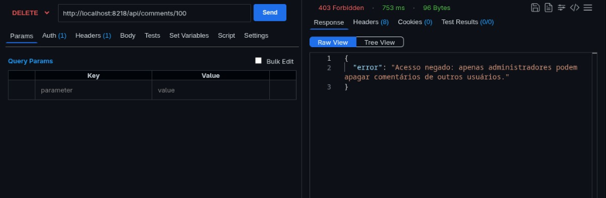
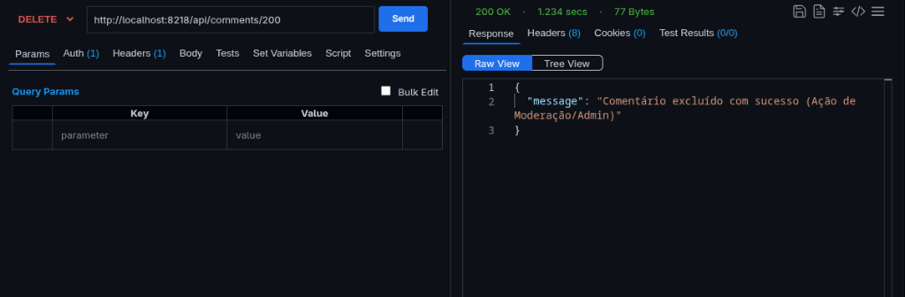
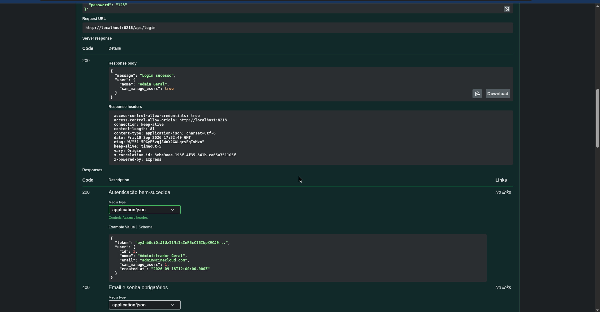

# Atividade de Cloud — Professor: [github.com/siriani](https://github.com/siriani)

Este repositório contém a implementação da atividade de Cloud, com Frontend em React (Vite) e Backend em Node.js (Express) com MariaDB, integrados à API da TMDB.

## Funcionalidades
- Cadastro e Login com hash de senhas e geração de JWT.
- **NOVO:** Microsserviço de autenticação isolado na rede interna do Docker (Atividade 3).
- **NOVO:** Recuperação de senha por e-mail com token e expiração (via Mailtrap).
- Isolamento de dados por usuário.
- Listagem de filmes do ator Tom Hanks usando a API oficial da TMDB (pesquisada via Backend).
- Favoritar filmes (armazenados no MariaDB pessoal).
- Comentar filmes (armazenados no MariaDB pessoal).
- **NOVO (Atividade 4):** Controle de Acesso Baseado em Papéis (RBAC) com enforcement no backend e moderação de comentários.
- **NOVO (Atividade 5):** Observabilidade & Logs de Auditoria — Microsserviço próprio (`log-service`) com Redis Streams, padrão CloudEvents v1.0, ECS e NIST SP 800-92.
- **NOVO (Atividade Extra):** Documentação interativa das APIs com Swagger UI e especificação OpenAPI 3.0 para os 3 microsserviços (Catálogo, Auth e Logs).


## Atividade 4 · Controle de Acesso por Papel (RBAC de Verdade)

### 1. Permissões Documentadas por Papel

No sistema, o controle de acesso é baseado no papel (`role`) atribuído ao usuário autenticado (`user`/`usuario` ou `admin`). O servidor valida estritamente cada ação.

| Recurso | Ação | Papel `usuario` | Papel `admin` | Endpoint |
|---|---|:---:|:---:|---|
| **Filmes** | Listar catálogo (Tom Hanks) | ✅ Permitido | ✅ Permitido | `GET /api/movies` |
| **Favoritos** | Listar próprios favoritos | ✅ Permitido | ✅ Permitido | `GET /api/favorites` |
| **Favoritos** | Adicionar favorito | ✅ Permitido | ✅ Permitido | `POST /api/favorites` |
| **Favoritos** | Remover próprio favorito | ✅ Permitido | ✅ Permitido | `DELETE /api/favorites/:id` |
| **Comentários** | Visualizar comentários nos filmes | ✅ Permitido | ✅ Permitido | `GET /api/comments/:id` |
| **Comentários** | Criar novo comentário | ✅ Permitido | ✅ Permitido | `POST /api/comments` |
| **Comentários** | Apagar o **próprio** comentário | ✅ Permitido | ✅ Permitido | `DELETE /api/comments/:id` |
| **Comentários** | Apagar comentário de **outros** (Moderação) | ❌ **403 Forbidden** | ✅ **200 OK** | `DELETE /api/comments/:id` |
| **Usuários** | Listar todos os usuários do sistema | ❌ **403 Forbidden** | ✅ **200 OK** | `GET /api/users` |

- **O que `usuario` pode fazer:** Pode navegar pelo catálogo de filmes, gerenciar sua própria lista de favoritos, publicar comentários em filmes e remover os seus próprios comentários.
- **O que `admin` pode fazer além disso:** Possui poder de **moderação total** sobre comentários (pode apagar comentários feitos por qualquer outro usuário) e acesso administrativo para visualizar todos os usuários cadastrados e seus respectivos papéis.

---

### 2. Ação Exclusiva de Admin e Enforcement no Backend

A ação exclusiva implementada é a **Moderação de Comentários** (`DELETE /api/comments/:id`):
- Quando um autor tenta apagar seu próprio comentário (`comment.usuario_id === req.userId`), a ação é autorizada imediatamente (**200 OK**).
- Quando qualquer usuário tenta apagar um comentário que pertence a outro usuário, o backend intercepta a ação e realiza a verificação de permissão no servidor via rede interna com o `auth-service`.
  - Se o usuário solicitante **não for admin**, o servidor recusa a requisição e responde com **403 Forbidden**: `{"error": "Acesso negado: apenas administradores podem apagar comentários de outros usuários."}`.
  - Se o usuário solicitante **for admin**, o servidor executa a exclusão com sucesso e responde com **200 OK**: `{"message": "Comentário excluído com sucesso (Ação de Moderação/Admin)"}`.
- Mesmo que o usuário comum tente invocar o endpoint diretamente via Postman, cURL ou manipular a interface, o backend bloqueia a ação, garantindo segurança real no servidor.

---

### 3. Demonstração Prática (Requisito 4)

A validação prática do controle de acesso baseado em papéis (RBAC) com enforcement no backend foi realizada com dois logins distintos tentando a mesma ação exclusiva de moderação (`DELETE /api/comments/:id`):

#### 📸 Print 1: Usuário Comum tenta apagar comentário de outro autor (403 Forbidden)
O usuário com papel `usuario` autenticado tenta apagar diretamente o comentário pertencente a outro autor (`DELETE /api/comments/100`). O backend intercepta a ação, consulta o `auth-service` via rede interna e **recusa imediatamente com HTTP 403 Forbidden**, comprovando que a segurança é aplicada no servidor:



---

#### 📸 Print 2: Administrador modera comentário de outro usuário (200 OK)
O usuário com papel `admin` autenticado executa a moderação em comentário criado por outro usuário (`DELETE /api/comments/200`). O backend consulta o `auth-service`, confirma o privilégio de administrador e **executa a exclusão com HTTP 200 OK**:



---

### 4. Segurança de Credenciais e Roles: Tratamento Exclusivo no Backend

Seguindo as melhores práticas de segurança corporativa e desenvolvimento web:
- **Zero Credenciais no Frontend (Cookies HttpOnly):** O token JWT não é exposto ao JavaScript do cliente e não é gravado em `localStorage`. No login, o backend define um cookie `HttpOnly; SameSite=Lax; Path=/`, garantindo imunidade a ataques de injeção XSS que tentem ler ou roubar a credencial. Todas as requisições subsequentes utilizam o cookie automaticamente com `withCredentials: true`. A validação e encerramento de sessão ocorrem através dos endpoints `/api/me` e `/api/logout`.
- **Zero Lógica de Roles no Frontend:** O cliente não realiza checagens condicionais de papel (`role === 'admin'`). O backend é a autoridade única e decide quais ações o usuário pode realizar, entregando capacidades funcionais já resolvidas (como `can_delete` e `is_moderation` nos comentários, e `can_manage_users` no perfil). Toda requisição para endpoints protegidos continua estritamente validada no servidor.

---

### 5. Resposta Técnica: Padrão A ou Padrão B? (Requisito 5)

> **Pergunta:** Qual dos dois padrões da seção de arquitetura o seu auth-service usa hoje? E o que mudaria no seu código se fosse pro outro padrão?

#### Qual padrão utilizamos hoje?
Nosso sistema utiliza o **PADRÃO A — Enforcement Centralizado**.

O serviço de catálogo (`backend`) atua desacoplado das regras de autorização dos usuários. Quando uma ação restrita ou sensível é solicitada (como moderação de comentários ou listagem administrativa de usuários), o catálogo realiza uma chamada HTTP interna via rede para o endpoint `POST /authorize` do `auth-service`, enviando o `userId` e a regra exigida (`requiredRole: 'admin'`). O `auth-service` consulta o papel atualizado do usuário diretamente no banco de dados MariaDB e decide centralizadamente se a ação é permitida ou não.

#### O que mudaria no código se fôssemos para o Padrão B (claims no JWT)?
Se migrássemos para o **Padrão B (Claims no JWT)**:
1. **No catálogo (`backend`):** Eliminaríamos a chamada de rede interna (`axios.post('${AUTH_SERVICE_URL}/authorize')`). O middleware de autenticação (`authenticateToken`) decodificaria o token JWT assinado e leria diretamente a propriedade `req.user.role`. A verificação seria puramente local em memória: `if (req.user.role !== 'admin') return res.status(403)`.
2. **No `auth-service`:** O endpoint `/authorize` deixaria de ser necessário para checagens em tempo de execução, já que a claim `role` viajaria encapsulada e assinada no próprio token.
3. **Trade-offs técnicos:**
   - **Vantagem do Padrão B:** Menor latência (elimina o round-trip de rede para cada ação restrita) e menor sobrecarga no `auth-service`.
   - **Desvantagem do Padrão B:** Perda de revogação/atualização imediata. Se um usuário for rebaixado ou promovido no banco, seu papel só terá efeito quando o token JWT atual expirar e um novo for gerado. No Padrão A adotado, qualquer alteração no banco tem efeito instantâneo.

---

## Atividade 5 · Observabilidade: Logs e Auditoria com Redis Streams

### 1. Arquitetura e Microsserviço Dedicado (`log-service`)

O sistema foi evoluído para garantir rastreabilidade completa e imutabilidade das ações executadas pelos usuários (quem fez o quê, quando e de onde). Em vez de gravar logs em arquivos locais de cada container — o que causaria dispersão, concorrência em I/O de disco e risco de exclusão acidental —, toda a ingestão e consulta de auditoria foi centralizada em um microsserviço dedicado: o **`log-service`**, integrado com **Redis Streams**.

```mermaid
flowchart TD
    subgraph Browser ["Navegador / Cliente"]
        UI["Interface React SPA / Flashpost Client"]
    end

    subgraph InternalNetwork ["Rede Interna Docker (bridge)"]
        subgraph AppGateway ["App / Catálogo (Porta 3000 -> 8218)"]
            Controller["catalogController / authProxyController"]
            BufferQueue["loggerService.js (Fila em Memória / Batching)"]
        end

        subgraph AuthService ["auth-service (Interno)"]
            Auth["Auth Service / RBAC Centralizado"]
        end

        subgraph LogMicroservice ["log-service (Interno)"]
            LogAPI["Log Controller (Express)"]
        end

        subgraph RedisCluster ["Redis 7 (AOF + Volume Persistente)"]
            Stream["Stream: audit_events (MAXLEN ~ 50000)"]
            DiskVolume[("Volume: redis_audit_data (/data/appendonly.aof)")]
        end
    end

    UI -->|HTTP / REST| Controller
    Controller -.->|RBAC Centralizado| Auth
    Controller -->|Enfileira Evento Assíncrono| BufferQueue
    BufferQueue -->|POST /logs/batch (a cada 500ms ou 10 itens)| LogAPI
    BufferQueue -->|Flush Imediato em 403 Denied| LogAPI
    LogAPI -->|XADD audit_events MAXLEN ~ 50000| Stream
    Stream -.->|AOF Persistente| DiskVolume
    Controller -->|GET /api/logs (Admin Only)| LogAPI
    LogAPI -->|XREVRANGE audit_events + -| Stream
```

#### Decisões Arquiteturais e Isolamento
- **Microsserviço Próprio (`log-service`):** Opera internamente na rede Docker sem portas expostas ao host (`ports` omitido no Docker Compose), prevenindo acesso externo não autorizado aos dados brutos de auditoria.
- **Por que Redis Streams?**
  - **Ordenação Temporal Estrita:** Cada evento na Stream recebe um ID cronológico gerado pelo Redis (`<millisecondsTime>-<sequenceNumber>`), garantindo sequência imutável de fatos.
  - **Eficiência Extrema de Ingestão:** O comando `XADD` possui complexidade \(O(1)\) para inserção.
  - **Controle de Volumetria Amortizado (`MAXLEN ~ 50000`):** O operador de aproximação `~` executa o corte de nós de macro-páginas (radix tree) do Redis de forma amortizada, eliminando pausas de thread do Redis causadas por trimming estrito.
  - **Consultas Paginadas Decrescentes (`XREVRANGE`):** Permite leitura ultra rápida a partir dos eventos mais recentes até os mais antigos com paginação via cursor.
- **Garantias de Persistência no Redis:**
  - Configurado com **AOF (Append-Only File)** ativo: `redis-server --appendonly yes --maxmemory 256mb --maxmemory-policy noeviction`.
  - Política `noeviction` garante que eventos de auditoria e segurança **nunca sejam descartados silenciosamente por falta de memória**.
  - Os dados são persistidos no volume Docker nomeado **`redis_audit_data`**, preservando o histórico de eventos mesmo após reinicializações completas dos containers.

---

### 2. Resiliência do Cliente Assíncrono (`backend/src/services/loggerService.js`)

Para proteger os serviços produtores (`backend`/catálogo e `auth`) contra gargalos e vazamento de conexões, a integração não realiza disparos HTTP bloqueantes nem "fire-and-forget" ingênuo. O cliente foi estruturado com os seguintes pilares de confiabilidade:

1. **Fila em Memória e Envio em Lote (Batching):** Os eventos são enfileirados em um buffer interno não-bloqueante e despachados em lotes para `POST /logs/batch` a cada **500 ms** ou assim que a fila atinge **10 eventos**.
2. **Despacho Imediato para Segurança (Immediate Flush):** Eventos com status `denied` ou ação de segurança (`tentativa_negada_403`) recebem prioridade máxima, acionando o esvaziamento imediato (`setImmediate`) para que violações de segurança fiquem disponíveis instantaneamente para inspeção.
3. **Retentativas Automáticas com Backoff Exponencial:** Caso o `log-service` esteja temporariamente indisponível durante uma reinicialização, o cliente reexecuta o envio do lote até 3 vezes com esperas exponenciais (200ms, 400ms, 800ms) antes de descartar.
4. **Sanitização de Dados Sensíveis (LGPD / GDPR / NIST):** O método `sanitize()` remove ou redige automaticamente chaves sensíveis como senhas, hashes, secrets e tokens JWT (`[REDACTED]`), impedindo que credenciais vazem para a base de auditoria.
5. **Rastreabilidade Distribuída (Correlation ID):** O middleware `correlationMiddleware.js` gera ou propaga um identificador único de rastreamento (`x-correlation-id`) via `crypto.randomUUID()`, anexado ao evento como `trace_id`.

---

### 3. Padrão Estrutural do Evento de Auditoria (CloudEvents v1.0 + ECS + NIST SP 800-92)

Todos os eventos gravados na Stream seguem o padrão global aberto **CloudEvents v1.0**, complementado com a taxonomia do **Elastic Common Schema (ECS)** e as diretrizes do **NIST SP 800-92** (Computer Security Log Management):

```json
{
  "stream_id": "1789749826217-0",
  "specversion": "1.0",
  "id": "1789749826215-98f7f626",
  "source": "service.catalog",
  "type": "audit.security.access_denied",
  "time": "2026-09-18T16:43:46.215Z",
  "trace_id": "6c5b6a68-0bfa-4d5e-b495-e7a0b152f0b0",
  "actor": {
    "id": "8",
    "role": "user",
    "ip": "127.0.0.1",
    "user_agent": "axios/1.20.0"
  },
  "action": "tentativa_negada_403",
  "status": "denied",
  "target": {
    "type": "comment",
    "id": 202,
    "author_id": 7
  },
  "metadata": {
    "motivo": "Tentativa não autorizada de apagar comentário de outro usuário"
  }
}
```

#### Dicionário de Campos Obrigatórios:
- **`specversion`**: Versão da especificação CloudEvents (`"1.0"`).
- **`id`**: Identificador único global do evento de log.
- **`source`**: Microsserviço originador do evento (`"service.catalog"`, `"service.auth"`).
- **`type`**: Categoria taxonômica do evento (ex: `audit.auth.login`, `audit.security.access_denied`).
- **`time`**: Carimbo de data/hora em formato UTC ISO-8601 estrito.
- **`trace_id`**: Identificador único de correlação de ponta a ponta da requisição.
- **`actor`**: Identidade completa do autor (`id`, `role`, `ip`, `user_agent`).
- **`action`**: Nome semântico e objetivo da ação executada.
- **`status`**: Resultado da operação (`"success"` ou `"denied"`).
- **`target`**: Objeto de negócio impactado (`movie`, `comment`, `session`, `route`).
- **`metadata`**: Contexto adicional sanitizado da operação.

---

### 4. Tabela de Eventos de Auditoria Monitorados

| Evento de Auditoria | Origem | Ação Semântica (`action`) | Tipo CloudEvents | Status | Alvo (`target`) |
|---|---|---|---|:---:|---|
| **Login bem-sucedido** | `service.auth` | `login` | `audit.auth.login` | `success` | `{ "type": "session" }` |
| **Login falho** | `service.auth` | `login_falhou` | `audit.auth.login_failed` | `denied` | `{ "type": "session" }` |
| **Logout** | `service.auth` | `logout` | `audit.auth.logout` | `success` | `{ "type": "session" }` |
| **Favoritar filme** | `service.catalog` | `favoritar` | `audit.favorite.add` | `success` | `{ "type": "movie", "id": 862 }` |
| **Desfavoritar filme** | `service.catalog` | `desfavoritar` | `audit.favorite.remove` | `success` | `{ "type": "movie", "id": 862 }` |
| **Adicionar comentário** | `service.catalog` | `comentar` | `audit.comment.create` | `success` | `{ "type": "comment", "id": <id> }` |
| **Apagar próprio comentário** | `service.catalog` | `apagar_comentario_proprio` | `audit.comment.delete_own` | `success` | `{ "type": "comment", "id": <id> }` |
| **Moderar comentário alheio** | `service.catalog` | `moderar_comentario` | `audit.comment.moderate` | `success` | `{ "type": "comment", "id": <id>, "author_id": <id> }` |
| **Tentativa Negada (Moderação)** | `service.catalog` | `tentativa_negada_403` | `audit.security.access_denied` | `denied` | `{ "type": "comment", "id": <id>, "author_id": <id> }` |
| **Tentativa Negada (Logs/Admin)**| `service.catalog` | `tentativa_negada_403` | `audit.security.access_denied` | `denied` | `{ "type": "route", "method": "GET", "path": "/api/logs" }` |

---

### 5. Endpoint de Consulta de Auditoria (`GET /api/logs`)

O acesso à trilha de auditoria é rigorosamente protegido por RBAC com validação centralizada:
- **Requisição por Usuário Comum:** Interceptada pelo middleware `requireAdminCentralized`. O servidor rejeita a chamada com **HTTP 403 Forbidden**, e **automaticamente registra um evento de tentativa negada (`tentativa_negada_403`) com prioridade imediata na Stream**.
- **Requisição por Administrador:** O backend autoriza a solicitação e consulta o `log-service` via rede interna, consumindo os eventos através do comando Redis `XREVRANGE audit_events + - COUNT <limit>` com paginação por cursor decrescente.
- **Painel Visual Integrado no Frontend:** O administrador possui o botão **`📜 Logs (Redis)`** no cabeçalho do catálogo, abrindo uma tabela interativa que exibe a trilha de auditoria em tempo real, com destaque para ações negadas (críticas) e identificadores de Stream.

---

### 6. Validação Prática e Sequência de Demonstração (Requisito da Atividade)

A validação de ponta a ponta do pipeline de observabilidade foi executada através da sequência completa de ações reais:

1. **Login de Usuário Comum (`usuario@teste.com`):** Sessão aberta e registrada como `audit.auth.login`.
2. **Favoritar Filme 862 (Toy Story):** Gravado evento `audit.favorite.add`.
3. **Publicar Comentário no Filme 862:** Gravado evento `audit.comment.create` (ID #201).
4. **Tentativa Negada de Apagar Comentário Alheio:** Usuário comum tenta deletar comentário criado pelo Admin. O backend recusa com **403 Forbidden** e dispara imediatamente o evento `audit.security.access_denied` (`tentativa_negada_403`).
5. **Tentativa Negada de Consultar Logs:** Usuário comum tenta acessar `GET /api/logs`. Recusado com **403 Forbidden** e registrado na auditoria.
6. **Login de Administrador (`admin_rbac@teste.com`):** Sessão administrativa registrada.
7. **Consulta de Logs pelo Administrador:** A chamada `GET /api/logs?limit=10` retorna com **200 OK** a trilha íntegra persistida na Stream do Redis.
8. **Moderação de Comentário por Administrador:** O admin exclui o comentário do usuário comum, registrando o evento de moderação `audit.comment.moderate`.

#### Evidência de Execução Real no Terminal / Redis:
```text
=== INICIANDO TESTE END-TO-END DE AUDITORIA & REDIS STREAMS ===

[1] Login como Usuario Comum (usuario@teste.com)...
Usuario Comum logado com sucesso! Cookie recebido.

[2] Usuario Comum favoritando filme 862 (Toy Story)...
Favorito adicionado: { message: 'Adicionado aos favoritos' }

[3] Usuario Comum comentando no filme 862...
Comentário criado com ID: 201

[4] Tentativa Negada 403: Usuario Comum tentando apagar comentário que não é dele...
Tentativa de apagar comentário de outro usuário retornou STATUS: 403 {
  error: 'Acesso negado: apenas administradores podem apagar comentários de outros usuários.'
}

[5] Tentativa Negada 403: Usuario Comum tentando consultar /api/logs...
Status retornado: 403 Mensagem: { error: 'Acesso negado: privilégios de administrador necessários.' }

[6] Login como Admin (admin_rbac@teste.com)...
Admin logado com sucesso!

[7] Admin consultando /api/logs (Redis Streams)...
Logs retornados com sucesso!
Total de logs recebidos: 9
Log #1: action=login status=success actor={"id":"7","role":"admin"} target={"type":"session"}
Log #2: action=tentativa_negada_403 status=denied actor={"id":"8","role":"user"} target={"type":"route","method":"GET","path":"/api/logs"}
Log #3: action=tentativa_negada_403 status=denied actor={"id":"8","role":"user"} target={"type":"comment","id":202,"author_id":7}
Log #4: action=comentar status=success actor={"id":"8","role":"user"} target={"type":"comment","id":201,"tmdb_movie_id":862}
Log #5: action=favoritar status=success actor={"id":"8","role":"user"} target={"type":"movie","id":862}

[8] Admin moderando comentário 201 criado por Usuario Comum...
Resultado moderação admin: {
  message: 'Comentário excluído com sucesso (Ação de Moderação/Admin)'
}
```

---

### 7. Como Testar via Flashpost / Postman

Importe a collection disponível na raiz do repositório:
- **Collection:** [`cloud-atividade.flashpost_collection.json`](./cloud-atividade.flashpost_collection.json)
- **Environment:** [`cloud-atividade.flashpost_environment.json`](./cloud-atividade.flashpost_environment.json)

Execute as requisições na pasta **`⭐ 4. Observabilidade & Auditoria Redis (Atividade 5)`**:
1. **`4.1 [ATV 5] Usuário Comum tenta consultar /api/logs`**: Confirma o retorno **`403 Forbidden`**.
2. **`4.2 [ATV 5] Admin consulta Trilha de Auditoria /api/logs`**: Retorna **`200 OK`** com todos os eventos estruturados consumidos da Stream do Redis.
3. **`4.3 [ATV 5] Admin consulta Logs com Paginação Cursor`**: Demonstra a navegação paginada decrescente utilizando o `cursor` do Redis Streams.

---

## Atividade Extra · Documentando suas APIs com Swagger / OpenAPI

### 1. Visão Geral da Especificação e Arquitetura

Para tornar todos os contratos de API visíveis, padronizados e testáveis diretamente pelo navegador (sem necessidade de consultar o código-fonte), a plataforma CineCloud foi 100% documentada sob a especificação **OpenAPI 3.0.3**, integrando a interface interativa do **Swagger UI**:

- **Interface Interativa do Swagger UI:** Disponível embutida no gateway da aplicação em [`http://localhost:8218/api-docs`](http://localhost:8218/api-docs) (alias: [`http://localhost:8218/apidocs`](http://localhost:8218/apidocs)).
- **Especificação OpenAPI Pura:**
  - Formato JSON: [`docs/openapi.json`](./docs/openapi.json) (ou endpoint `GET /api/openapi.json`).
  - Formato YAML: [`docs/openapi.yaml`](./docs/openapi.yaml) pronto para importar no [editor.swagger.io](https://editor.swagger.io).
- **Atalho no Frontend:** Botão **"Swagger"** adicionado no cabeçalho executivo da aplicação CineCloud, permitindo alternar instantaneamente entre a interface visual e a documentação técnica.

---

### 2. Microsserviços e Endpoints Documentados (14 Contratos)

A especificação engloba os 3 microsserviços do ecossistema CineCloud (atendendo amplamente ao Requisito 1 de cobrir múltiplos serviços):

| Microsserviço | Tag | Método | Endpoint | Descrição & Respostas Mapeadas |
| :--- | :--- | :---: | :--- | :--- |
| **Auth-Service** | Autenticação & Sessão | `POST` | `/api/register` | Registro de novos usuários com hash bcrypt (201, 400, 409). |
| **Auth-Service** | Autenticação & Sessão | `POST` | `/api/login` | Autenticação, emissão de JWT e auditoria (200, 400, 401). |
| **Auth-Service** | Autenticação & Sessão | `POST` | `/api/logout` | Encerramento de sessão e registro de auditoria (200). |
| **Auth-Service** | Autenticação & Sessão | `GET` | `/api/me` | Consulta do usuário logado via Bearer JWT (200, 401). |
| **Auth-Service** | Autenticação & Sessão | `POST` | `/api/forgot-password`| Disparo de token de recuperação via Mailtrap (200, 400). |
| **Auth-Service** | Autenticação & Sessão | `POST` | `/api/reset-password` | Atualização de senha com validação de token (200, 400). |
| **Auth-Service** | Administração & RBAC | `GET` | `/api/users` | Listagem de usuários restrita a administradores (200, 401, 403). |
| **Catálogo** | Catálogo de Filmes | `GET` | `/api/movies` | Filmografia completa do Tom Hanks via TMDB (200, 401, 500). |
| **Catálogo** | Favoritos | `GET` | `/api/favorites` | Lista de favoritos do usuário autenticado (200, 401). |
| **Catálogo** | Favoritos | `POST` | `/api/favorites` | Adição de favorito com auditoria no Redis (201, 400, 409). |
| **Catálogo** | Favoritos | `DELETE`| `/api/favorites/:id` | Remoção de favorito com auditoria no Redis (200, 404). |
| **Catálogo** | Comentários & Moderação | `GET` | `/api/comments/:id` | Listagem de resenhas da comunidade por filme (200, 401). |
| **Catálogo** | Comentários & Moderação | `POST` | `/api/comments` | Publicação de comentário com auditoria no Redis (201, 400). |
| **Catálogo** | Comentários & Moderação | `DELETE`| `/api/comments/:id` | Exclusão pelo autor ou moderação exclusiva por Admin (200, 403, 404). |
| **Log-Service** | Auditoria & Observabilidade | `GET` | `/api/logs` | Consulta decrescente da Stream do Redis com paginação cursor (200, 401, 403). |

---

### 3. Autenticação e "Try it out" no Swagger UI

A especificação inclui o esquema de segurança padrão OpenAPI `components.securitySchemes.BearerAuth`, permitindo testar requisições autenticadas sem sair da página do Swagger:

1. Acesse [`http://localhost:8218/api-docs`](http://localhost:8218/api-docs) no navegador.
2. Expanda o endpoint **`POST /api/login`**, clique em **"Try it out"** e envie o payload de credenciais (ex: `admin_rbac@teste.com` / `123`).
3. Copie o valor do token retornado no cabeçalho `Set-Cookie` ou no corpo da resposta.
4. No topo do Swagger UI, clique no botão verde **"Authorize 🔓"**.
5. Cole o token no campo de texto e clique em **Authorize**.
6. Agora, todos os endpoints protegidos (`/api/movies`, `/api/favorites`, `/api/users`, `/api/logs`, etc.) podem ser executados diretamente com o botão **"Execute"**!

---

### 4. Demonstração Prática da Chamada Real (Requisito 4)

Abaixo é demonstrada a execução em tempo real de uma chamada via "Try it out" no Swagger UI embutido na aplicação, com resposta real `200 OK` retornada pelo backend:



---

## Tecnologias
- **Frontend:** React, Vite, Axios, React Router.
- **Backend (API Gateway / Catálogo):** Node.js, Express, mysql2.
- **Microsserviço de Autenticação (Auth):** Node.js, Express, mysql2, bcrypt, jsonwebtoken, nodemailer.
- **Microsserviço de Auditoria (Log-Service):** Node.js, Express, ioredis.
- **Banco de Dados Relacional:** MariaDB.
- **Armazenamento de Eventos e Trilha de Auditoria:** Redis 7 (Redis Streams + AOF Persistente).
- **Infraestrutura:** Docker, Docker Compose (Multistage build).


## Deploy
Para rodar via Portainer, configure as variáveis na Stack:
- `DB_HOST`, `DB_USER`, `DB_PASS`, `DB_NAME`
- `TMDB_API_KEY`
- `JWT_SECRET`
- `SMTP_USER`, `SMTP_PASS` (Mailtrap)
- `PUBLIC_URL` (URL pública para os links de reset de senha)

(Veja o `.env.example` para referências).